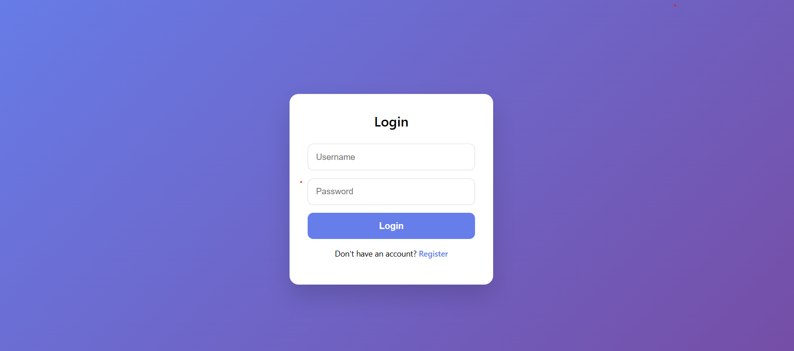
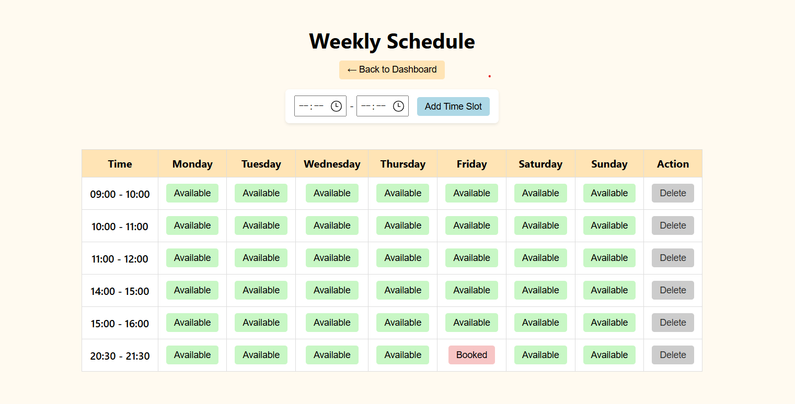

# Login & Schedule Management System

A lightweight **Flask + SQLite** web application for user authentication
and time-slot based schedule/booking management.\
Designed for personal tutoring, course scheduling, or small-scale
appointment systems.

------------------------------------------------------------------------

## ✨ Features

-   ✅ User registration, login, and logout
-   🔐 Session-based authentication with `login_required`
-   ⏰ Custom time slots
    -   Add / delete / update slots
-   📅 Weekly schedule view
-   🔁 Toggle booking availability with one click
-   🧩 Clean service-layer architecture (easy to extend)
-   ⚡ Simple deployment with Flask & SQLite

------------------------------------------------------------------------

## 📂 Project Structure

    loginScheduleSys/
    │
    ├── app.py                  # Flask application entry point
    ├── config.py               # Global configuration (e.g., DAYS)
    ├── extensions.py           # Authentication decorators
    │
    ├── services/
    │   ├── user_service.py     # User-related logic
    │   ├── slot_service.py     # Time slot management
    │   └── schedule_service.py # Schedule & booking logic
    │
    ├── templates/
    │   ├── index.html          # Login page
    │   ├── register.html       # Registration page
    │   ├── dashboard.html      # User dashboard
    │   └── schedule.html       # Weekly schedule page
    │
    ├── static/
    │   └── css/                # Stylesheets
    │
    └── database.db             # SQLite database

------------------------------------------------------------------------

## 🚀 Getting Started

### 1️⃣ Clone the Repository

``` bash
git clone LoginSchedulesys
cd LoginSchedulesys
```

### 2️⃣ Create a Virtual Environment (Recommended)

``` bash
python -m venv venv
source venv/bin/activate   # macOS / Linux
venv\Scripts\activate    # Windows
```

### 3️⃣ Install Dependencies

``` bash
pip install flask
```

### 4️⃣ Run the Application

``` bash
python LoginSystemSchedule.py
```

Then open your browser at:

    http://localhost:port

------------------------------------------------------------------------

## 🔑 Environment Variables (Optional)

``` bash
export SECRET_KEY="your-secret-key"
```

If not set, a default development key will be used (for local
development only).

------------------------------------------------------------------------

## 🔌 API Overview

### User APIs

  Endpoint                Method   Description
  ----------------------- -------- ---------------------
  `/api/register`         POST     Register a new user
  `/api/login`            POST     User login
  `/api/delete_account`   POST     Delete user account
  `/logout`               GET      Logout

### Time Slot APIs

  Endpoint                   Method   Description
  -------------------------- -------- ---------------------
  `/api/slots`               POST     Add a new time slot
  `/api/slots/<id>`          POST     Delete a time slot
  `/api/slots/<id>/update`   POST     Update a time slot

### Schedule APIs

  Endpoint    Method   Description
  ----------- -------- -----------------------------
  `/toggle`   POST     Toggle booking availability

------------------------------------------------------------------------

## 🛠 Tech Stack

-   Python 3.x
-   Flask
-   SQLite
-   HTML / CSS / JavaScript (AJAX)

------------------------------------------------------------------------

## 📌 Use Cases

-   Tutoring or course scheduling system
-   Personal time management tool
-   Flask learning / teaching project
-   Backend + database practice project

------------------------------------------------------------------------

## 📄 License

MIT License

------------------------------------------------------------------------

This project is especially suitable for: - **Computer Science / AI
students** - **Flask backend practice** - **Internship / portfolio
projects**
